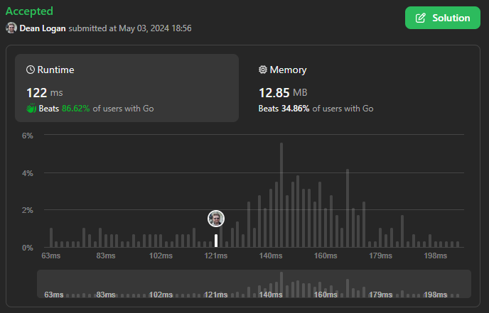

# 853. Car Fleet

There are `n` cars going to the same destination along a one-lane road. The destination is `target` miles away.  

You are given two integer arrays `position` and `speed`, both of length `n`, where `position[i]` is the position of the `ith` car and `speed[i]` is the speed of the `ith` car (in miles per hour).  

A car can never pass another car ahead of it, but it can catch up to it and drive bumper to bumper **at the same speed**. The faster car will **slow down** to match the slower car's speed. The distance between these two cars is ignored (i.e, they are assumed to have the same position).  

A **car fleet** is some non-empty set of cars driving at the same position and same speed. Note that a single car is also a car fleet.  

If a car catches up to a car fleet right at the destination point, it will still be considered as one car fleet.  

Return *the **number of car fleets** that will arrive at the destination.*

**Example 1:**  
    **Input:** `target = 12, position = [10,8,0,5,3], speed = [2,4,1,1,3]`  
    **Output:** `3`  
    **Explanation:**  
```
    The cars starting at 10 (speed 2) and 8 (speed 4) become a fleet, meeting each other at 12. 
    The car starting at 0 does not catch up to any other car, so it is a fleet by itself. 
    The cars starting at 5 (speed 1) and 3 (speed 3) become a fleet, meeting each other at 6. The fleet moves at speed 1 until it reaches target. 
    Note that no other cars meet these fleets before the destination, so the answer is 3.
```  

**Example 2:**  
    **Input:** `target = 10, position = [3], speed = [3]`  
    **Output:** `1`  
    **Explanation:** `There is only one car, hence there is only one fleet.`  

**Example 3:**  
    **Input:** `target = 100, position = [0,2,4], speed = [4,2,1]`  
    **Output:** `1`  
    **Explanation:**  
```
    The cars starting at 0 (speed 4) and 2 (speed 2) become a fleet, meeting each other at 4. The fleet moves at speed 2.
    Then, the fleet (speed 2) and the car starting at 4 (speed 1) become one fleet, meeting each other at 6. 
    The fleet moves at speed 1 until it reaches target.
```  

**Constraints:**  
    `n == position.length == speed.length`  
    `1 <= n <= 10**5`  
    `0 < target <= 10**6`  
    `0 <= position[i] < target`  
    `All the values of position are unique`  
    `0 <= speed <= 10**6`  

## Submission Screenshot

