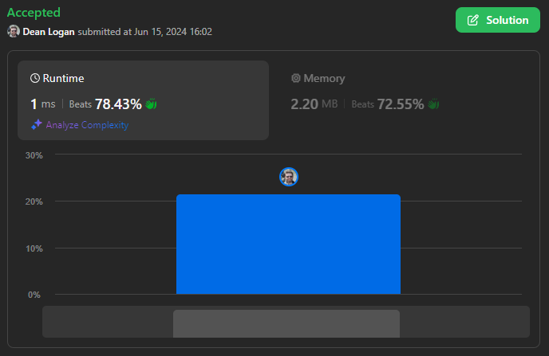

# 405. Convert a Number to Hexadecimal

Given an integer `num`, return *a string representing its hexadecimal representation*. For negative integers, two’s complement method is used.  

All the letters in the answer string should be lowercase characters, and there should not be any leading zeros in the answer except for the zero itself.  

Note: You are not allowed to use any built-in library method to directly solve this problem.   

**Example 1:**  
    **Input:** `num = 26`  
    **Output** `"1a"`   
    **Explanation:** `III = 3.`   

**Example 2:**  
    **Input:** `num = -1`  
    **Output** `"ffffffff"`    

**Constraints**  
    `-2**31 <= num <= 2**31 - 1`  

## Submission Screenshot  

