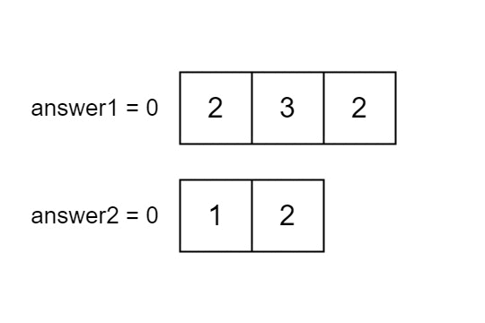

# 2956. Find Common Elements Between Two Arrays

You are given two integer arrays `nums1` and `nums2` of sizes `n` and `m`, respectively. Calculate the following values:

- `answer1`: the number of indices `i` such that `nums1[i]` exists in `nums2`.
- `answer2`: the number of indices `i` such that `nums2[i]` exists in `nums1`.

Return `[answer1, answer2]`.

**Example 1:**  
      
    **Input:** `nums1 = [2,3,2], nums2 = [1,2]`  
    **Output:** `[2,1]`   

**Example 2:**  
    **Input:** `nums1 = [4,3,2,3,1], nums2 = [2,2,5,2,3,6]`  
    **Output:** `[3,4]`   

**Example 3:**  
    **Input:** `nums1 = [3,4,2,3], nums2 = [1,5]`  
    **Output:** `[0,0]`   

**Constraints:**  
    `n == nums1.length`  
    `m == nums2.length`  
    `1 <= n, m <= 100`  
    `1 <= nums1[i], nums2[i] <= 100`  

## Submission Screenshot

