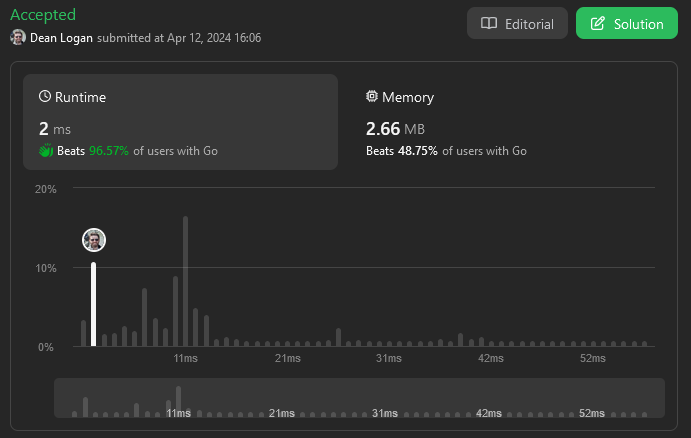

# 424. Longest Repeating Character Replacement

Given a string `s`, find the length of the **longest** substring without repeating characters

**Example 1:**  
    **Input:** `s = "ABAB", k = 2`  
    **Output:** `4`  
    **Explanation:** `Replace the two 'A's with two 'B's or vice versa.`  

**Example 2:**  
    **Input:** `s = "AABABBA", k = 1`    
    **Output:** `4`  
    **Explanation:** `Replace the one 'A' in the middle with 'B' and form "AABBBBA". The substring "BBBB" has the longest repeating letters, which is 4. There may exists other ways to achieve this answer too.`  

**Constraints:**  
    `1 <= s.length <= 10**5`  
    `s consists of only uppercase English letters.`  
    `0 <= k <= s.length`  

## Submission Screenshot

