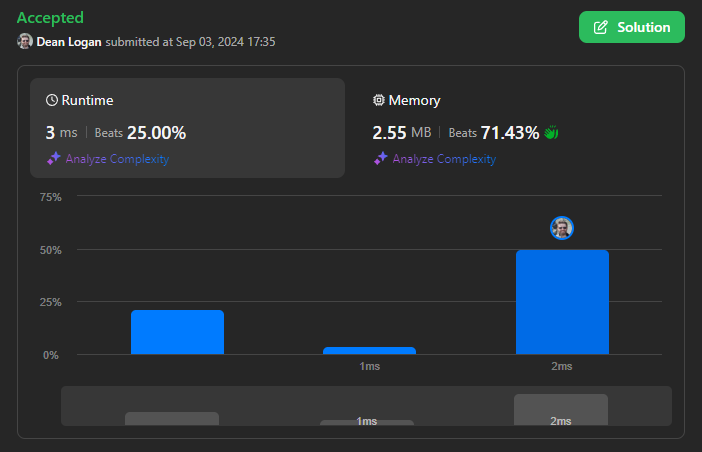

# 2383. Minimum Hours of Training to Win a Competition

You are entering a competition, and are given two **positive** integers `initialEnergy` and `initialExperience` denoting your initial energy and initial experience respectively.

You are also given two **0-indexed** integer arrays `energy` and `experience`, both of length `n`.

You will face n opponents in order. The energy and experience of the `ith` opponent is denoted by `energy[i]` and `experience[i]` respectively. When you face an opponent, you need to have both strictly greater experience and energy to defeat them and move to the next opponent if available.

Defeating the `ith` opponent **increases** your experience by `experience[i]`, but **decreases** your energy by `energy[i]`.

Before starting the competition, you can train for some number of hours. After each hour of training, you can **either** choose to increase your initial experience by one, or increase your initial energy by one.

Return *the **minimum** number of training hours required to defeat all `n` opponents*.

**Example 1:**  
    **Input:** `initialEnergy = 5, initialExperience = 3, energy = [1,4,3,2], experience = [2,6,3,1]`  
    **Output:** `8`   
    **Explanation:**   
```
You can increase your energy to 11 after 6 hours of training, and your experience to 5 after 2 hours of training.
You face the opponents in the following order:
- You have more energy and experience than the 0th opponent so you win.
  Your energy becomes 11 - 1 = 10, and your experience becomes 5 + 2 = 7.
- You have more energy and experience than the 1st opponent so you win.
  Your energy becomes 10 - 4 = 6, and your experience becomes 7 + 6 = 13.
- You have more energy and experience than the 2nd opponent so you win.
  Your energy becomes 6 - 3 = 3, and your experience becomes 13 + 3 = 16.
- You have more energy and experience than the 3rd opponent so you win.
  Your energy becomes 3 - 2 = 1, and your experience becomes 16 + 1 = 17.
You did a total of 6 + 2 = 8 hours of training before the competition, so we return 8.
It can be proven that no smaller answer exists.
```   

**Example 2:**  
    **Input:** `initialEnergy = 2, initialExperience = 4, energy = [1], experience = [3]`  
    **Output:** `0`   
    **Explanation:** `You do not need any additional energy or experience to win the competition, so we return 0.`   

**Constraints:**  
    `n == energy.length == experience.length`   
    `1 <= n <= 100`   
    `1 <= initialEnergy, initialExperience, energy[i], experience[i] <= 100`   

## Submission Screenshot

