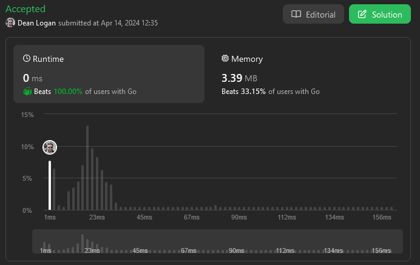

# 76. Minimum Window Substring

Given two strings `s` and `t` of lengths `m` and `n` respectively, return the ***minimum window substring*** *of `s` such that every character in `t` (**including duplicates**) is included in the window. If there is no such substring, return the empty string `""`*.

The testcases will be generated such that the answer is **unique**.

**Example 1:**
    **Input:** `s = "ADOBECODEBANC", t = "ABC"`
    **Output:** `BANC`  
    **Explanation:** `The minimum window substring "BANC" includes 'A', 'B', and 'C' from string t.`

**Example 2:**
    **Input:** `s = "a", t = "a"`  
    **Output:** `a`
    **Explanation:** `The entire string s is the minimum window.`

**Example 3:**
    **Input:** `s = "a", t = "aa"`  
    **Output:** `""`
    **Explanation:** `Both 'a's from t must be included in the window. Since the largest window of s only has one 'a', return empty string.`

**Constraints:**
    `m == s.length`
    `n == t.length`
    `1 <= m, n <= 10**5`
    `s and t consist of uppercase and lowercase English letters.`

## Submission Screenshot

