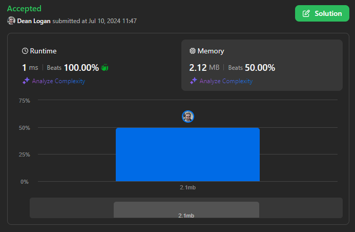

# 1175. Prime Arrangements

Return the number of permutations of 1 to `n` so that prime numbers are at prime indices (1-indexed).

*(Recall that an integer is prime if and only if it is greater than 1, and cannot be written as a product of two positive integers both smaller than it)*

Since the answer may be large, return the answer **modulo** `10^9 + 7`.

**Example 1:**  
    **Input:** `n = 5`  
    **Output:** `2`   
    **Explanation:** `For example [1,2,5,4,3] is a valid permutation, but [5,2,3,4,1] is not because the prime number 5 is at index 1.`   

**Example 2:**  
    **Input:** `n = 100`  
    **Output:** `682289015`   

**Constraints:**  
    `1 <= n <= 100`   

## Submission Screenshot

