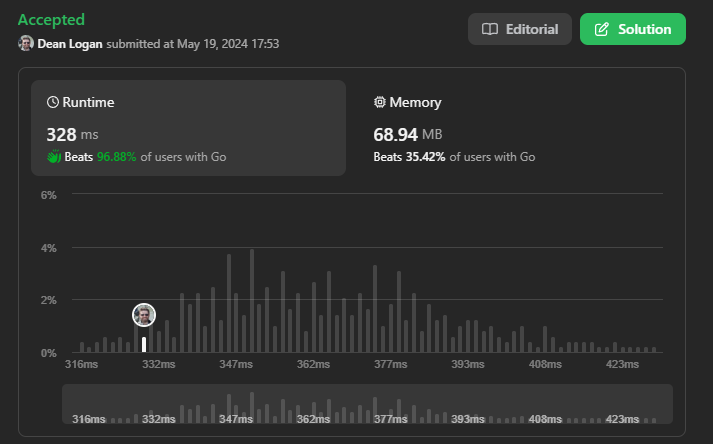

# 981. Time Based Key-Value Store

Design a time-based key-value data structure that can store multiple values for the same key at different time stamps and retrieve the key's value at a certain timestamp.  

Implement the `TimeMap` class:  
* `TimeMap()` initializes the object of the data structure.  
* `void set(String key, String value, int timestamp)` stores the key `key` with the value `value` at the given time `timestamp`.  
* `String get(String key, int timestamp)` returns a value such that `set` was called previously, with `timestamp_prev <= timestamp`. If there are multiple such values, it returns the value associated with the largest `timestamp_prev`. If there are no values, it returns `""`.

**Example 1:**  
    **Input:** `["TimeMap", "set", "get", "get", "set", "get", "get"] [[], ["foo", "bar", 1], ["foo", 1], ["foo", 3], ["foo", "bar2", 4], ["foo", 4], ["foo", 5]]`  
    **Output** `[null, null, "bar", "bar", null, "bar2", "bar2"]`   
    **Explanation:**   
```
TimeMap timeMap = new TimeMap();
timeMap.set("foo", "bar", 1);  // store the key "foo" and value "bar" along with timestamp = 1.
timeMap.get("foo", 1);         // return "bar"
timeMap.get("foo", 3);         // return "bar", since there is no value corresponding to foo at timestamp 3 and timestamp 2, then the only value is at timestamp 1 is "bar".
timeMap.set("foo", "bar2", 4); // store the key "foo" and value "bar2" along with timestamp = 4.
timeMap.get("foo", 4);         // return "bar2"
timeMap.get("foo", 5);         // return "bar2"
```         

**Constraints**  
    `1 <= key.length, value.length <= 100`  
    `key and value consist of lowercase English letters and digits.`  
    `1 <= timestamp <= 10**7`  
    `All the timestamps timestamp of set are strictly increasing.`  
    `At most 2 * 10**5 calls will be made to set and get.`  

## Submission Screenshot  

